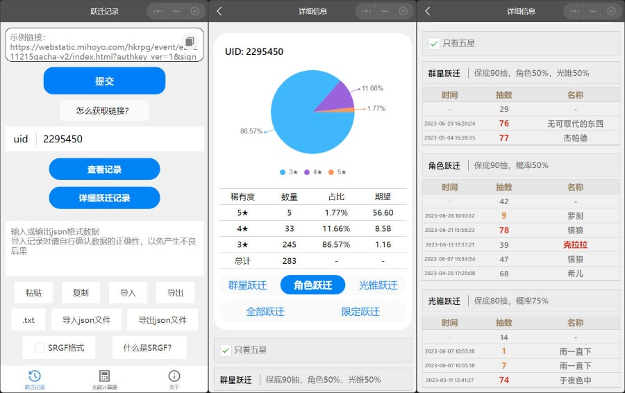

# 咸鱼的崩铁助理

《咸鱼的崩铁助理》截至写下本文，实现了跃迁记录的获取与分析、以及充能计算器。

本文简单介绍这个小程序。

## 跃迁记录分析

主要功能的技术原理：

1. 跃迁记录的获取：
   通过`https://api-takumi.mihoyo.com/common/gacha_record/api/getGachaLog?`这一API实现，具体原理应该不需要我做过多说明。
2. 跃迁记录的分析：
   我这里将跃迁记录按照`gacha_type`分别保存在三个列表中（不处理始发跃迁，因为没意思），然后将所有计算得到的数据保存在变量里，调用uCharts绘制图表。
3. 跃迁记录的保持：
   原本是将记录保存在小程序缓存中的，单个key数据上限1M，粗估需要4000条跃迁记录才会爆炸，但是微信的大聪明缓存机制和开发文档里写得不一样。
   最终保存在本地用户文件里了。
4. 文本形式的跃迁记录导入/导出：
   复制、粘贴、读文件、写文件、以及少量的文本格式验证。
5. 文件形式的跃迁记录导入/导出：
   - 导入：
     - 微信移动端：`wx.chooseMessageFile()`
     - 微信PC端：`wx.chooseMedia()`，但是要用户手动修改文件后缀名
     - QQ移动端：`wx.chooseMessageFile()`，QQ没有相关API，但是微信的API可以用
   - 导出：
     - 微信移动端：`wx.shareFileMessage()`
     - 微信PC端：`wx.saveFileToDisk()`
     - QQ移动端：`wx.openDocument()`，这个API在微信里无法打开格式错误的文件，但是在QQ里可以，安卓版未验证
6. SRGF的适配：
   其实没啥好说的，因为我这边是直接保存了`api-takumi.mihoyo.com`返回的全部数据，所以按照格式改改，再排个序就行了。

## 充能计算器

我定义了一种数据结构，把数值填进去，再把接口写好，就能得到一个 Excel Pro Max 了。

其他的就直接看[README](README.md)吧。

## 其他

Q&A

- Q：为什么跃迁记录分析不开源？
  A：因为代码写得一坨。
- Q：QQ端小程序在哪呢？
  A：在备案审核。
- Q：有其他端的开发计划吗？
  A：有，但是新建文件夹。
- Q：为什么要做这个小程序？
  A：跃迁记录：大家都有，做来练手；充能计算器：我自己要用。
